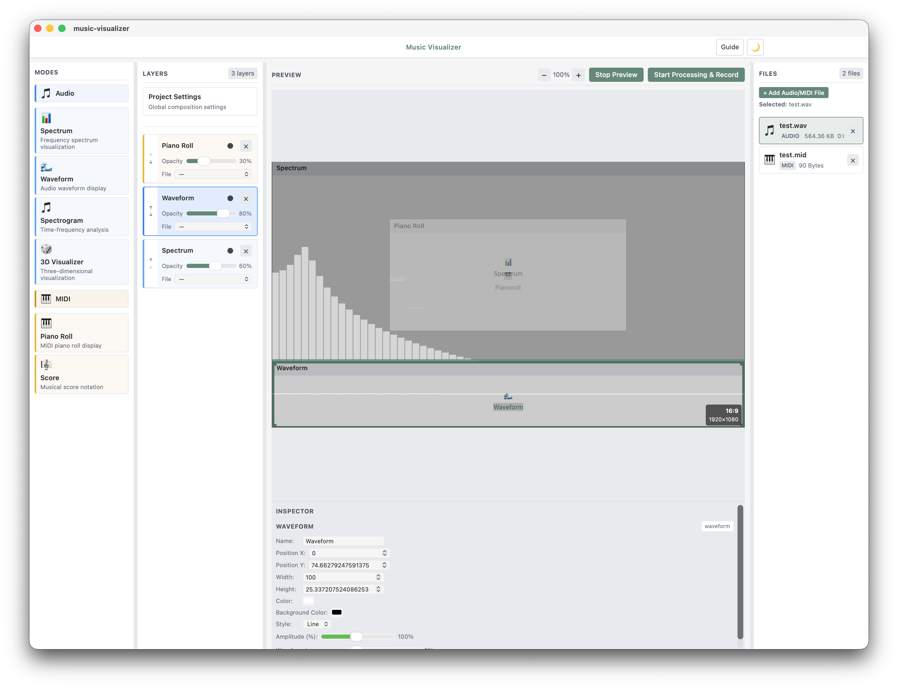

# Music Visualizer - Project Overview

音源（Audio）と MIDI を読み込み、複数のビジュアライゼーションをレイヤー合成してプレビュー・録画・出力できるアプリケーションです。

---

## Screenshot

※ リポジトリ内にスクリーンショット画像が見当たらないため、`screen-shot.png` を置くかパスを変更してください。

---

## Technologies
- HTML + CSS（SvelteKit のコンポーネント/スタイル）
- SvelteKit + TypeScript
- Tauri（デスクトップアプリ化、ファイル保存/変換呼び出し）
- Web Audio API（`AudioContext` / `AnalyserNode` による解析）
- Canvas 2D（スペクトラム/波形/スペクトログラム等の描画）
- Three.js（`3D Visualizer` の描画）
- Tone.js（MIDI 再生）
- @tonejs/midi（MIDI ファイルの解析）
- MediaRecorder（キャンバス+音声の録画）
- FFmpeg（WebM→MP4 等の変換。Tauri 経由で呼び出し）

---

## Overview

| Item | Description |
| --- | --- |
| Entry | `src/app.html`（HTMLテンプレート） + `src/routes/*`（各ページ） |
| UI | ホーム（各 Visualization への導線）／Music Visualizer（レイヤー合成UI）／個別可視化（Audio/MIDI） |
| 音源解析 | Audioは `AudioContext` + `AnalyserNode` で周波数/波形データを生成し、各レイヤーを描画 |
| 出力 | 録画は `MediaRecorder` で WebM を保存し、必要に応じて FFmpeg で変換 |

---

## Layout

### Music Visualizer
- **Modes パネル**: Audio/MIDI の種類（例: Spectrum / Waveform / Spectrogram / 3D / Piano Roll / Score）からドラッグしてレイヤーを追加
- **Layers パネル**: レイヤーの一覧。ドラッグで位置変更、リサイズハンドルでサイズ変更、Opacity と File の割り当て（レイヤーに紐づけ）
- **Preview パネル**: 合成結果をキャンバス上でリアルタイム表示。ズーム/アスペクト比/解像度を調整
- **Settings パネル**:  
  - Global 設定（Aspect/Resolution、背景色、FPS、Quality など）  
  - レイヤー設定（Position/Size/Mode固有パラメータ）
- **Files パネル**: Audio/MIDI ファイルの読み込みと管理（複数ファイル対応）
- **Resizer**: `modes/layers/files` および設定パネルの縦幅をドラッグで変更可能

---

## Mode kinds

### Audio
- `spectrum` : 周波数スペクトラム（スタイル切替: circular/center/normal/line など）
- `waveform` : 時系列の波形表示（line / fill）
- `spectrogram` : 時間-周波数マップ（カラーマップ切替）
- `3d` : Three.js による 3D ビジュアル（回転/配置など）

### MIDI
- `pianoroll` : ピアノロール表示（Multi-View では解析データをもとに描画）
- `score` : スコア表示（Multi-View では解析データをもとに描画）

---

## File binding
- **Load（読み込み）**: Audio/MIDI を `Files` パネルから追加
- **Assign（割り当て）**: 各レイヤーに `File` を割り当てる UI を備えています
- **Preview/Export**: Music Visualizer のプレビュー/録画は、`selectedFile` を `decodeAudioData` して得た Audio 解析データをベースに描画します（そのため、現状の MIDI 系レイヤーは「MIDIそのもの」ではなく音声解析データを用いた疑似描画になります）
- **MIDI再生/解析**: MIDI の再生・解析（Tone.js / @tonejs/midi）は、`/midi/pianoroll` や `/midi/score` 等の個別ページで主に行います

---

## Save / Load

### Load
- Audioファイル（例: `.wav/.mp3/.flac/.aac/.ogg`）および MIDI（`.mid/.midi`）を読み込み
- Music Visualizer では Modes からレイヤーを追加して、合成を作成します

### Save（録画・出力）
- 録画は `MediaRecorder` で生成した WebM を保存します
- 出力形式は WebM を基準に、`exportFormat` と `convertAfterRecording` が有効な場合に FFmpeg で変換します（MP4など）
- 変換にはローカルに `ffmpeg` が必要です（未導入時は WebM のみ）

---

## Main files

| File | Role |
| --- | --- |
| `src/routes/multi-view-composer/+page.svelte` | Music Visualizer の実装（レイヤー合成UI、プレビュー、録画/出力） |
| `src/routes/audio/*/+page.svelte` | Audio 各可視化（Spectrum/Waveform/Spectrogram/3D）の個別ページ |
| `src/routes/midi/*/+page.svelte` | MIDI 各可視化（Piano Roll / Score）の個別ページ |
| `src/routes/+page.svelte` | ホーム画面（各可視化への導線） |
| `src/app.html` | SvelteKit の HTMLテンプレート |
| `src-tauri/src/lib.rs` | FFmpeg による動画変換（`convert_video` / `check_ffmpeg_installed`） |
| `package.json` | 依存関係（Tauri/SvelteKit、three/tone/@tonejs/midi 等） |

---